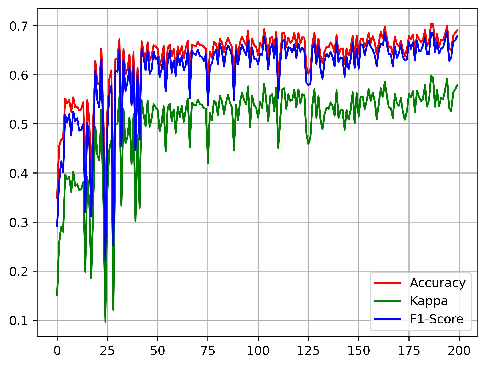

# Introduction
This motor imagery brain-computer interface and EEG decoding process uses only convolutional networks. The data used is the 2a dataset of BCI Competition IV, which contains four motor imagery classes: left hand, right hand, foot, and tongue. The raw data can be downloaded from the official website of the BCI competition: https://www.bbci.de/competition/iv/. The preprocessed data used in this work can be downloaded from: https://github.com/bregydoc/bcidatasetIV2a.git. This work uses 22 electrode data from 9 subjects, with 2264 valid trials, including 1827 training trials (consisting of 80% of each subject's trials) and 437 testing trials, with a training and testing data ratio of 8:2.

This work evaluates the decoding performance using accuracy, Kappa, and F1-score. In the test, the trained model achieves an average of 0.6906, 0.5787, and 0.6785 for the three indicators. We provide the test outputs and the trained model in the ‘results’ folder.

# Results
In the results folder, metrics.csv is a record of the evaluation metrics in 200 training epochs. Its 2-4 columns are accuracy, kappa, and F1-score, and metrics.png is its visualization.

In addition, best.tar is our trained model. Real.npy is the real classification of 437 trials in the test set, and Pred.npy is the predicted classification of 437 trials using the best.tar. Among them, 0, 1, 2, and 3 represent the four classes of left, right, foot, and tongue, respectively. In the figure below, the black upward triangle represents the real trial that occurred, and the blue downward triangle represents the predicted trial. We marked the successful prediction trial with a long green line and the failed prediction trial with a short red line. On the test set, the prediction accuracy of our model averaged 69.0%.

# Acknowledgements
The preprocessing of BCICIV2a data in this work is derived from this work: https://github.com/bregydoc/bcidatasetIV2a.git, which is gratefully acknowledged.

